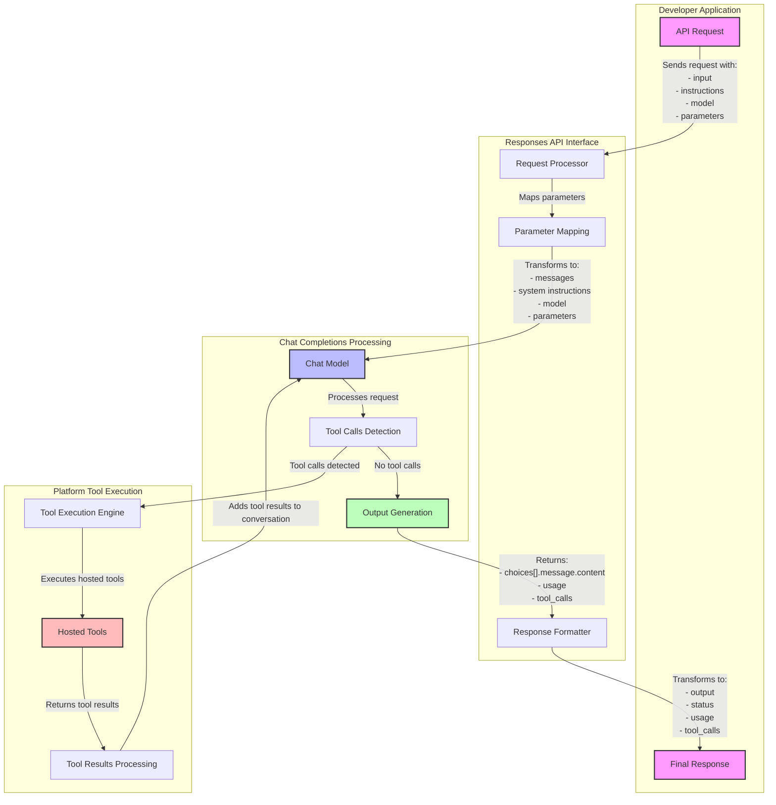

# Using Chat Completions API via Responses API

This guide provides a comprehensive mapping to help you use the Chat Completions API functionality through the Responses API interface.

## Property Mappings

### Request Parameters

| Responses API Property                | Chat Completions API Equivalent                    | Notes                                   |
|---------------------------------------|---------------------------------------------------|-----------------------------------------|
| `input`                               | `messages`                                        | Structure your input as messages array  |
| `input.content`                       | `messages.content`                                | Content structure for messages          |
| `input.content.text`                  | `messages.content.text`                           | Text content in message                 |
| `input.content.image_url`             | `messages.content.image_url`                      | Image URL for multimodal inputs         |
| `input.content.file_id`               | `messages.content.file_id`                        | File reference                          |
| `input.role`                          | `messages.role`                                   | User, assistant, or system role         |
| `model`                               | `model`                                           | Model identifier                        |
| `instructions`                        | `messages` (role: `system` or `developer`)        | Add as system/developer messages        |
| `max_output_tokens`                   | `max_completion_tokens`                           | Maximum tokens in response              |
| `parallel_tool_calls`                 | `parallel_tool_calls`                             | Enable parallel tool calls              |
| `temperature`                         | `temperature`                                     | Controls randomness                     |
| `top_p`                               | `top_p`                                           | Controls diversity via nucleus sampling |
| `tools`                               | `tools`                                           | Available tools for the model           |
| `tool_choice`                         | `tool_choice`                                     | Specifies which tool to use             |
| `metadata`                            | `metadata`                                        | Custom metadata for the request         |
| `stream`                              | `stream`                                          | Enable streaming response               |
| `store`                               | `store`                                           | Persist conversation history            |
| `reasoning.effort`                    | `reasoning_effort`                                | Controls reasoning depth                |
| `text.format`                         | `response_format.type`                            | Specifies response format               |
| `text.format.type`                    | `response_format.type`                            | Type of response format                 |
| `text.format.json_schema`             | `response_format.json_schema`                     | JSON schema for structured responses    |

## Implementation Details

The Masaic platform handles several complex mappings between Responses API and Chat Completions API that are worth noting:

### Input Message Conversion (Handled by Masaic)

The conversion between `input` and `messages` involves complex logic:

- **Role-Based Processing**: Messages are handled differently based on role:
  - `user`: Converted to `user` message with appropriate content parts
  - `assistant`: Converted to `assistant` message
  - `system`: Converted to `system` message and concatenated with instructions
  - `developer`: Converted to `developer` message and concatenated with instructions
  - `tool`: Converted to `tool` message

- **Content Handling**: Different content types are processed specifically:
  - Text input: Directly mapped as text content
  - Image input: Converted to image URL parameters with detail settings
  - File input: Mapped to file references with appropriate metadata

### Tool Integration (Handled by Masaic)

Tools conversion is more sophisticated than documented:

- **Tool Types Support**: The platform handles specific tool types:
  - Function tools: Complete definition with parameters converted
  - Web search tools: Mapped to function definitions with appropriate naming (Via Hosted Tool)
  - File search tools: Converted with configuration parameters (COMING SOON)
  - Computer use preview tools: Mapped to appropriate function calls (COMING SOON)

- **Tool Choice Conversion**: Tool choice is converted based on type:
  - Options-based choice: Mapped to `auto` or `none`
  - Function-based choice: Mapped to specific function name reference
  - Types-based choice: Mapped to type identifier

### Response Format Handling (Handled by Masaic)

The conversion between `text.format` and `response_format` includes:

- **Format Types**:
  - Text format: Direct mapping to text response
  - JSON Object format: Mapped to structured JSON output
  - JSON Schema format: Complex mapping with schema definition conversion

### System Interaction (Handled by Masaic)

- **Instructions Merging**: When system messages exist in the input, instructions are appended rather than replacing
- **System Message Priority**: System messages from the input take precedence over separate instruction fields

### Reasoning Configuration (Handled by Masaic)

- **Reasoning Effort**: Converted to the appropriate `ReasoningEffort` enum value
- **Reasoning Summary**: Generated separately in the response based on model output

### Hosted Tool Call Processing (Handled by Masaic)

- **Hosted Function Calls**: Processed in sequence and fed-back to the completion API for response generation.

### Response Properties

| Responses API Response Property       | Chat Completions API Response Equivalent          | Notes                                     |
|---------------------------------------|--------------------------------------------------|-------------------------------------------|
| `created_at`                          | `created`                                        | Timestamp of response creation            |
| `id`                                  | `id`                                             | Unique identifier for the response        |
| `model`                               | `model`                                          | Model used for the response               |
| `object`                              | `object` (always `chat.completion`)              | Object type identifier                    |
| `output`                              | `choices[].message.content`                      | Main content of the response              |
| `output_text`                         | `choices[].message.content`                      | Text content of the response              |
| `status`                              | `choices[].finish_reason`                        | Reason for completion                     |
| `usage`                               | `usage`                                          | Token usage statistics                    |
| `tool_calls`                          | `choices[].message.tool_calls`                   | Tool calls in the response                |

### Streaming Implementation (Handled by Masaic)

Streaming events in the Responses API are mapped to Chat Completions API events through a customized conversion process:

- **Event Mapping**: Each Responses API event corresponds to specific Chat Completions delta chunks:
  - Initial events (`response.created`) are generated when streaming starts
  - Content delta events map to content updates in Chat Completions
  - Tool call events are carefully synchronized with function call chunks
  
- **State Management**: The Masaic layer maintains internal state to ensure:
  - Proper sequencing of events
  - Tracking of incremental content updates
  - Appropriate event aggregation

- **Chunk Processing**: The platform handles:
  - Parsing of delta chunks from Chat Completions API
  - Transforming chunks to appropriate event types
  - Managing content buffering and flushing

#### Streaming Events Mapping

The table below shows the detailed mapping between Responses API streaming events and Chat Completions API events:

| Responses API Event                   | Chat Completions API Equivalent                               | When Published | Implementation Details |
|---------------------------------------|---------------------------------------------------------------|----------------|------------------------|
| `response.created`                    | Initial chunk creation                                        | On request initiation | Masaic generates this when streaming starts |
| `response.in_progress`                | Streaming chunks (`choices[].delta`)                          | As response streams | Sent for each content chunk |
| `response.completed`                  | Final chunk with `finish_reason: stop`                        | Completion of response | Generated when final chunk is received |
| `response.failed`                     | HTTP error response                                           | On error occurrence | Masaic handles error mapping |
| `response.incomplete`                 | Final chunk with `finish_reason: length`                      | Token limit exceeded | Detected via finish reason |
| `response.output_item.added`          | Streaming chunks (`choices[].delta`)                          | As new items begin streaming | Generated at content boundaries |
| `response.output_item.done`           | Final chunk completion (`finish_reason`)                      | Item streaming completion | Sent when item is complete |
| `response.content_part.added`         | N/A - Masaic-specific enhancement                             | As content parts start | Provides finer-grained progress |
| `response.content_part.done`          | N/A - Masaic-specific enhancement                             | Content streaming completed | Indicates part completion |
| `response.output_text.delta`          | Partial streaming (`choices[].delta.content`)                 | Each incremental content piece | Direct mapping of content chunks |
| `response.output_text.done`           | Final chunk (`choices[].message.content`)                     | Text content finalized | Generated when content finishes |
| `response.refusal.delta`              | Error handling (Masaic enhancement)                           | Incremental refusal text | Special handling for moderation |
| `response.refusal.done`               | Error handling (Masaic enhancement)                           | Refusal text finalized | Marks completion of refusal |
| `response.function_call_arguments.delta` | Partial function call arguments streaming (`choices[].delta`) | Partial function arguments | Mapped from tool call fragments |
| `response.function_call_arguments.done`  | Final function arguments chunk                                | Function call arguments finalized | Generated when tool call completes |
| `response.file_search_call.*`         | Managed as tool calls (Masaic enhancement)                         | File search lifecycle | Custom tool implementation |
| `response.web_search_call.*`          | Managed as tool calls (Masaic enhancement)                         | Web search lifecycle | Custom tool implementation |

#### Implementation Specifics

The Masaic implementation includes following components for streaming:

1. **Event Buffer Management**:
   - Maintains partial content state across stream chunks
   - Assembles coherent events from partial data
   - Manages tool call state across multiple chunks

2. **Custom Event Generation**:
   - Creates Masaic-specific events for enhanced user experience
   - Provides finer-grained progress indication than Chat Completions API
   - Handles special cases like content refusals

3. **Error and Edge Case Handling**:
   - Graceful processing of premature stream termination
   - Recovery from temporary connection issues
   - Special handling for content moderation interruptions

4. **Tool Call Streaming**:
   - Synchronization between tool calls and results
   - Progress indication for tool execution
   - Proper sequencing of multi-turn tool interactions

## Masaic Layer Managed Properties

When using Chat Completions API via Responses API, the following Responses API features have limited or no direct support in the standard Chat Completions API and require special handling by the Masaic platform:

### Conversation Management (Masaic-Managed) (COMING SOON)

- **`previous_response_id`**: Conversation history tracking and chaining
  - Masaic maintains conversation state between requests
  - Reconstructs message history based on previous interactions
  - Not directly supported in Chat Completions API

### Response Control (Masaic-Managed) (COMING SOON)

- **`truncation` Strategy**:
  - `auto`: Masaic implements automatic content truncation based on token limits
  - `disabled`: Platform ensures complete responses without truncation
  - Custom handling required as Chat Completions has simpler max token controls

### Output Customization (Masaic-Managed) (COMING SOON)

- **`include` Parameter**:
  - Controls which components appear in the response
  - Masaic filters response objects based on these specifications
  - Not directly available in Chat Completions API

### Reasoning Features (Masaic-Enhanced)

- **`reasoning.generate_summary`**:
  - Masaic extracts and generates reasoning summaries from model outputs
  - Platform performs additional processing to extract reasoning patterns

### Additional Masaic-Specific Enhancements

1. **Error Handling**:
   - Enhanced error reporting with detailed status codes
   - User-friendly error messages with recovery suggestions
   - Consistent error format across all response types

2. **Metadata Management**:
   - Preservation of metadata between requests and responses
   - Additional context tracking not available in Chat Completions
   - Custom fields for application-specific requirements

3. **Request Normalization**:
   - Automatic handling of various input formats
   - Standardization of inconsistent parameters
   - Backward compatibility with legacy request formats

4. **Response Format Standardization**:
   - Consistent output structure regardless of request variations
   - Normalized tool call formats across different model versions
   - Backward compatible output for different client versions

## Modality Support (COMING SOON)

Both interfaces will support:
- Multimodal inputs (text, image, audio)
- Audio outputs 

## Implementation Notes

When using Chat Completions functionality through the Responses API, follow these best practices based on how the Masaic platform processes your requests:

### Input Structure Best Practices

- **Message Organization**:
  - Structure your `input` as a well-formed array of messages with clear roles
  - Use appropriate role types (`user`, `assistant`, `system`, `developer`, `tool`)
  - Place system messages before user messages for consistent processing

- **Content Formatting**:
  - Provide multimodal content (text, images, files) as structured objects
  - Use consistent formatting for each content type
  - Follow content structure requirements exactly to avoid conversion errors

- **Tool Definition**:
  - Define tools completely with all required parameters
  - Use consistent naming across tool definitions and calls
  - Prefer function-type tools for best compatibility

### Processing Considerations

- **System Instructions**:
  - When using both `instructions` and system messages in `input`, be aware they will be concatenated
  - System messages in `input` take precedence in positioning
  - Use only one approach (either `instructions` or system messages) for clarity

- **Tool Call Handling**:
  - Multi-turn tool calls are processed recursively by Masaic
  - Tool call IDs are crucial for proper mapping between calls and responses
  - Limit the number of tool calls to avoid hitting platform limits

- **Response Processing**:
  - Structure parsers to handle the normalized output format
  - For streaming, process events based on the event mapping table
  - Handle both success and error states appropriately

## Example API Calls

The following examples demonstrate how to structure requests for the Responses API, with comments explaining how Masaic processes each one:

### Basic Text Completion

```bash
# This example shows a simple text input
# Masaic processes this by:
# 1. Converting the string input to a user message
# 2. Creating a User message
# 3. Setting the content directly as text
curl -X POST https://api.openai.com/v1/responses \
-H "Content-Type: application/json" \
-H "Authorization: Bearer YOUR_API_KEY" \
-d '{
  "model": "gpt-4o",
  "input": "Hello, world!"
}'
```

### Completion with Instructions

```bash
# This example demonstrates using instructions
# Masaic processes this by:
# 1. Creating a system message with the instructions
# 2. Adding it before the user message
# 3. Setting appropriate roles for each message
curl -X POST https://api.openai.com/v1/responses \
-H "Content-Type: application/json" \
-H "Authorization: Bearer YOUR_API_KEY" \
-d '{
  "model": "gpt-4o",
  "instructions": "Answer concisely.",
  "input": "Explain AI."
}'
```

### Completion with Temperature Adjustment

```bash
# This example shows parameter passing
# Masaic directly maps the temperature parameter to ChatCompletions
curl -X POST https://api.openai.com/v1/responses \
-H "Content-Type: application/json" \
-H "Authorization: Bearer YOUR_API_KEY" \
-d '{
  "model": "gpt-4o",
  "temperature": 0.5,
  "input": "Suggest a creative startup idea."
}'
```

### Structured JSON Output

```bash
# This example demonstrates JSON formatting
# Masaic processes this by:
# 1. Converting text.format to response_format
# 2. Setting the appropriate JSON schema parameters
# 3. Configuring the model to return structured output
curl -X POST https://api.openai.com/v1/responses \
-H "Content-Type: application/json" \
-H "Authorization: Bearer YOUR_API_KEY" \
-d '{
    "model": "gpt-4o-2024-08-06",
    "input": [
      {
        "role": "system",
        "content": "You are a helpful math tutor. Guide the user through the solution step by step."
      },
      {
        "role": "user",
        "content": "how can I solve 8x + 7 = -23"
      }
    ],
    "text": {
      "format": {
        "type": "json_schema",
        "name": "math_reasoning",
        "schema": {
          "type": "object",
          "properties": {
            "steps": {
              "type": "array",
              "items": {
                "type": "object",
                "properties": {
                  "explanation": { "type": "string" },
                  "output": { "type": "string" }
                },
                "required": ["explanation", "output"],
                "additionalProperties": false
              }
            },
            "final_answer": { "type": "string" }
          },
          "required": ["steps", "final_answer"],
          "additionalProperties": false
        },
        "strict": true
      }
    }
  }'
```

### Multimodal Text & Image Input

```bash
# This example shows multimodal input handling
# Masaic processes this by:
# 1. Converting each content item to content part objects
# 2. Creating appropriate type-specific handlers for text and image
# 3. Setting detail parameters for the image
curl -X POST https://api.openai.com/v1/responses \
-H "Content-Type: application/json" \
-H "Authorization: Bearer YOUR_API_KEY" \
-d '{
    "model": "gpt-4o",
    "input": [
      {
        "role": "user",
        "content": [
          {"type": "input_text", "text": "what is in this image?"},
          {
            "type": "input_image",
            "image_url": "https://upload.wikimedia.org/wikipedia/commons/thumb/d/dd/Gfp-wisconsin-madison-the-nature-boardwalk.jpg/2560px-Gfp-wisconsin-madison-the-nature-boardwalk.jpg"
          }
        ]
      }
    ]
  }'
```

### Using Tools

```bash
# This example demonstrates tool usage
# Masaic processes this by:
# 1. Converting tool definitions to completion tools objects
# 2. Setting up the appropriate function structure
# 3. Handling tool calls and responses through recursive processing
curl -X POST https://api.openai.com/v1/responses \
-H "Content-Type: application/json" \
-H "Authorization: Bearer YOUR_API_KEY" \
-d '{
    "model": "gpt-4o",
    "input": "What is the weather like in Boston today?",
    "tools": [
      {
        "type": "function",
        "name": "get_current_weather",
        "description": "Get the current weather in a given location",
        "parameters": {
          "type": "object",
          "properties": {
            "location": {
              "type": "string",
              "description": "The city and state, e.g. San Francisco, CA"
            },
            "unit": {
              "type": "string",
              "enum": ["celsius", "fahrenheit"]
            }
          },
          "required": ["location", "unit"]
        }
      }
    ],
    "tool_choice": "auto"
  }'
```

### Streaming Response

```bash
# This example shows streaming configuration
# Masaic handles this by:
# 1. Setting up an SSE connection
# 2. Converting Chat Completion chunks to Responses API events
# 3. Managing state across streamed chunks
curl -N -X POST https://api.openai.com/v1/responses \
-H "Content-Type: application/json" \
-H "Authorization: Bearer YOUR_API_KEY" \
-d '{
  "model": "gpt-4o",
  "input": "Stream your response.",
  "stream": true
}'
```

### With Metadata

```bash
# This example demonstrates metadata handling
# Masaic preserves and passes through metadata (Coming soon)
# This is useful for request tracing and client-side state management 
curl -X POST https://api.openai.com/v1/responses \
-H "Content-Type: application/json" \
-H "Authorization: Bearer YOUR_API_KEY" \
-d '{
  "model": "gpt-4o",
  "input": "Metadata example.",
  "store": true,
  "metadata": {
    "request_id": "12345",
    "user": "test_user"
  }
}'
```

# Request flow:


